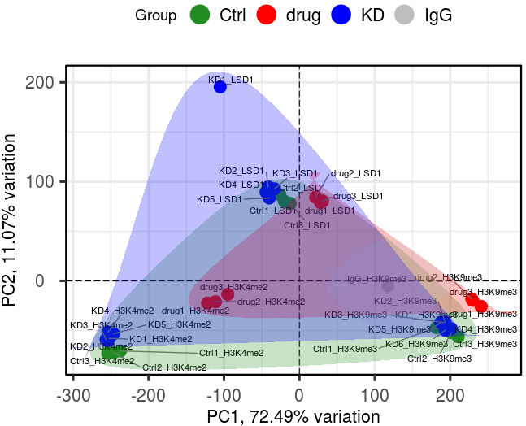
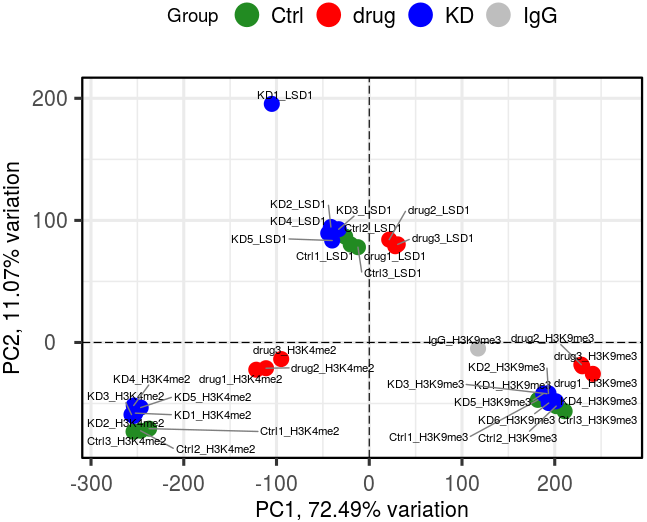
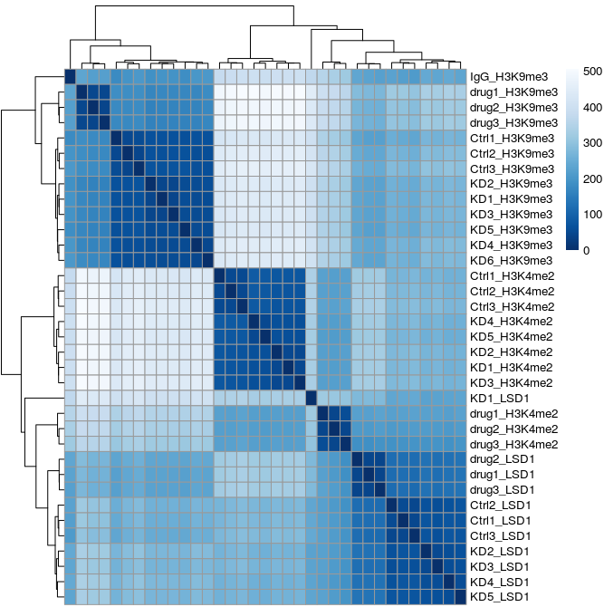
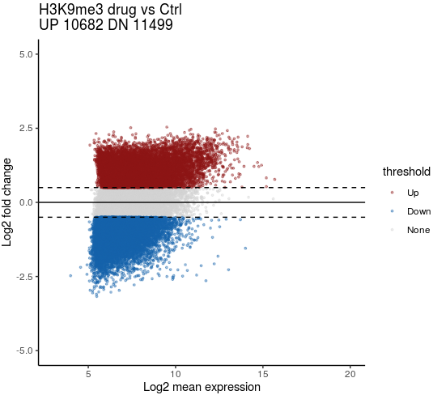

# Part2.  the statistic calculation on `R` environment in each CUT&Tag-seq data

## 2.1 loading the package in R

~~~R
suppressPackageStartupMessages({
  library(dplyr)
  library(Matrix)
  library(proxy)
  library(gplots)
  library(plyr)
  library(DOSE)
  library(clusterProfiler)
  library(topGO)
  library(pathview)
  library(AnnotationDbi)
  library(cowplot)
  library(ggplot2)
  library(velocyto.R)
  library(trqwe)
  library(Rsamtools)
  library(GenomicFeatures)
  library(GenomicAlignments)
  library(BiocParallel)
  library(pheatmap)
  library(RColorBrewer)
  library(PoiClaClu)
  library(org.Mm.eg.db)
  library(org.Hs.eg.db)
  library(DESeq2)
  library(data.table)
  library(stringr)
  library(tidyr)
  library(GenomicRanges)
  library(viridis)
  library(chromVAR)
  library(ggpubr)
  library(corrplot)
  library(scales)
  library(BuenColors)
  library(PCAtools)
  library(ChIPseeker)
  library(TxDb.Mmusculus.UCSC.mm10.knownGene)
  library(TxDb.Hsapiens.UCSC.hg19.knownGene)
})
~~~

## 2.2 Quantify the counts of peaks in all samples

To get the counts number of peaks in all samples, we need to integrate all peaks calling from all samples firstly. As you could import the `mac3` and/or `SEACR` results into `R` to make them be a `GRanges` object. 

~~~R
Peaks <- list.files(path = "/mnt/data/user_data/xiangyu/workshop/CUTTAG/OTS_19_CUTTAG_35_samples_TL_PXY_9122/SEACR",
                    pattern = glob2rx("*_0.01_non.stringent.bed*"),
                    full.names = TRUE)
mPeak = GRanges()
## overlap with bam file to get count
for(hist in Peaks){
    peakRes = read.table(hist, header = FALSE, fill = TRUE)
    mPeak = GRanges(seqnames = peakRes$V1, IRanges(start = peakRes$V2, end = peakRes$V3), strand = "*") %>% append(mPeak, .)
}
masterPeak = reduce(mPeak)
~~~

And you could check the `masterPeak` as following structure:

~~~R
GRanges object with 56660 ranges and 0 metadata columns:
          seqnames            ranges strand
             <Rle>         <IRanges>  <Rle>
      [1]     chr1        9978-27024      *
      [2]     chr1       27461-38231      *
      [3]     chr1       38260-40240      *
      [4]     chr1     130208-149870      *
      [5]     chr1     169009-171527      *
      ...      ...               ...    ...
  [56656]     chrY 58976355-58998339      *
  [56657]     chrY 59097962-59102171      *
  [56658]     chrY 59212838-59215648      *
  [56659]     chrY 59334312-59339355      *
  [56660]     chrY 59340489-59345012      *
  -------
  seqinfo: 25 sequences from an unspecified genome; no seqlengths
~~~

Then, we used the function `getCounts` implemented in `chromVAR` to quantify the counts number in all samples.

~~~R
bamDir = list.files(path = "/mnt/data/user_data/xiangyu/workshop/CUTTAG/OTS_19_CUTTAG_35_samples_TL_PXY_9122/filter_bam/", pattern = ".filter_dupli.bam$", full.names = TRUE)
All_data_ <- future_lapply(bamDir, function(bamFile) {
  fragment_counts <- getCounts(bamFile, masterPeak, paired = TRUE, by_rg = FALSE, format = "bam")
  sel_d <- as.data.frame(t(as.matrix(counts(fragment_counts))))
  return(sel_d)
  })
All_data <- as.data.frame(rbindlist(All_data_))
rownames(All_data) <- gsub("/mnt/data/user_data/xiangyu/workshop/CUTTAG/OTS_19_CUTTAG_35_samples_TL_PXY_9122/filter_bam/","",bamDir)
rownames(All_data) <- gsub(".filter_dupli.bam","",rownames(All_data))
All_data <- as.data.frame(t(All_data))
masterPeak1 <- as.data.frame(masterPeak)
rownames(All_data) <- paste(masterPeak1$seqnames,masterPeak1$start,masterPeak1$end,sep="_")
~~~

To make it easy to invoke the counts data in following analysis, you should store `All_data` as `.rds` and/or `,csv` files. 

~~~R
mcsaveRDS(All_data,"/mnt/data/user_data/xiangyu/workshop/CUTTAG/OTS_19_CUTTAG_35_samples_TL_PXY_9122/analysis_data/Only_Ki67_counts.rds",mc.cores=20)
~~~

Then, you would get the counts as following: 

~~~R
> All_data[1:5,1:5]
                   Ctrl1_H3K4me2 Ctrl1_H3K9me3 Ctrl1_LSD1 Ctrl2_H3K4me2
chr1_9978_27024              391          2092       2998           441
chr1_27461_38231             526           233        173           485
chr1_38260_40240              20            48         35            13
chr1_130208_149870           135           669        286           149
chr1_169009_171527             8            65         18            11
                   Ctrl2_H3K9me3
chr1_9978_27024             2146
chr1_27461_38231             235
chr1_38260_40240              57
chr1_130208_149870           777
chr1_169009_171527            83
~~~

## 2.3 The counts data Normalization by `DESeq2`

As mentioned in home page, `DESeq2` would be used to normalize counts data of CUT&Tag-se, which was much better to reduce the effect of peak size and library size. 

~~~R
All_data <- mcreadRDS("/mnt/data/user_data/xiangyu/workshop/CUTTAG/OTS_19_CUTTAG_35_samples_TL_PXY_9122/analysis_data/Only_Ki67_counts.rds",mc.cores=20)
selectR = which(rowSums(All_data) > 10) ## remove low count genes
dataS = All_data[selectR,]
chr_pos <- as.data.frame(do.call(rbind,str_split(rownames(dataS),"_")))
colnames(chr_pos) <- c("chr","start","end")
chr_pos$start <- as.numeric(as.character(chr_pos$start))
chr_pos$end <- as.numeric(as.character(chr_pos$end))
masterPeak1 <- GenomicRanges::makeGRangesFromDataFrame(df=chr_pos,keep.extra.columns = TRUE)
metaData <- data.frame(Group=c("Ctrl", "Ctrl", "Ctrl", "Ctrl","Ctrl", "Ctrl", "Ctrl", "Ctrl","Ctrl", 
  "drug", "drug", "drug","drug", "drug", "drug", "drug","drug", "drug", "IgG", 
  "KD", "KD", "KD", "KD", "KD","KD", "KD", "KD", 
  "KD","KD", "KD", "KD", "KD","KD", "KD", "KD"),
    histone=c("H3K4me2", "H3K9me3", "LSD1", "H3K4me2","H3K9me3", "LSD1", "H3K4me2", "H3K9me3","LSD1", 
      "H3K4me2", "H3K9me3", "LSD1","H3K4me2", "H3K9me3", "LSD1", "H3K4me2","H3K9me3", "LSD1", "IgG", 
      "H3K4me2", "H3K9me3", "LSD1", "H3K4me2", "H3K9me3","LSD1", "H3K4me2", "H3K9me3", 
      "LSD1","H3K4me2", "H3K9me3", "LSD1", "H3K4me2","H3K9me3", "LSD1", "H3K9me3"),
    sample=c("Ctrl1_H3K4me2", "Ctrl1_H3K9me3", "Ctrl1_LSD1", "Ctrl2_H3K4me2","Ctrl2_H3K9me3", "Ctrl2_LSD1", "Ctrl3_H3K4me2", "Ctrl3_H3K9me3","Ctrl3_LSD1", 
      "drug1_H3K4me2", "drug1_H3K9me3", "drug1_LSD1","drug2_H3K4me2", "drug2_H3K9me3", "drug2_LSD1", "drug3_H3K4me2","drug3_H3K9me3", "drug3_LSD1", "IgG_H3K9me3", 
      "KD1_H3K4me2", "KD1_H3K9me3", "KD1_LSD1", "KD2_H3K4me2", "KD2_H3K9me3","KD2_LSD1", "KD3_H3K4me2", "KD3_H3K9me3", 
      "KD3_LSD1","KD4_H3K4me2", "KD4_H3K9me3", "KD4_LSD1", "KD5_H3K4me2","KD5_H3K9me3", "KD5_LSD1", "KD6_H3K9me3"),
    row.names = colnames(dataS))
dds = DESeqDataSetFromMatrix(countData = dataS, colData = metaData, design = ~ Group, rowRanges = masterPeak1)
dds <- estimateSizeFactors(dds)
~~~

## 2.4 The visualization of PCA and hierarchical clustering of all samples.

To validate the similarity and differences of each sample, the PCA map would be used by `PCAtools`

~~~R
vst <- assay(vst(dds))
p <- pca(vst, metadata = colData(dds), removeVar = 0.1)
biplot(p,
colby = 'Group', colkey = c('Ctrl' = 'forestgreen', 'drug' = 'red', 'KD' = 'blue', 'IgG' = "grey"),
colLegendTitle = 'Group ',pointSize = 5,
  encircle = TRUE,
  encircleFill = TRUE,
hline = 0, vline = c(0),
legendPosition = 'top', legendLabSize = 16, legendIconSize = 8.0)
~~~

~~~R
biplot(p,
colby = 'Group', colkey = c('Ctrl' = 'forestgreen', 'drug' = 'red', 'KD' = 'blue', 'IgG' = "grey"),
colLegendTitle = 'Group ',pointSize = 5,
  encircle = FALSE,
  encircleFill = FALSE,
hline = 0, vline = c(0),
legendPosition = 'top', legendLabSize = 16, legendIconSize = 8.0)
~~~

And the hierarchical clustering was also used to analyze the similarity and differences of each sample.

~~~R
vsd <- vst(dds, blind = FALSE)
sampleDists <- dist(t(assay(vsd)))
samplePoisDistMatrix <- as.matrix(sampleDists)
rownames(samplePoisDistMatrix) <- colData(vsd)$sample
colnames(samplePoisDistMatrix) <- NULL
colors <- colorRampPalette( rev(brewer.pal(9, "Blues")) )(255)
pheatmap(samplePoisDistMatrix,
clustering_distance_rows = sampleDists,
clustering_distance_cols = sampleDists,
col = colors)
~~~

## 2.5 The differential peaks identification and peaks annotation

~~~R
DDS = DESeq(dds,parallel=TRUE)
H3K4me2_drug_vs_Ctrl = results(DDS, c("Group", "drug", "Ctrl"), independentFiltering = FALSE, 
  altHypothesis = "greaterAbs", format = "GRanges",parallel=TRUE)
anno_H3K4me2_drug_vs_Ctrl <- annotatePeak(H3K4me2_drug_vs_Ctrl, tssRegion=c(-3000, 3000),TxDb=TxDb.Hsapiens.UCSC.hg19.knownGene, annoDb="org.Hs.eg.db")
anno_H3K4me2_drug_vs_Ctrl_df <- as.data.frame(anno_H3K4me2_drug_vs_Ctrl)
rownames(anno_H3K4me2_drug_vs_Ctrl_df) <- rownames(elementMetadata(anno_H3K4me2_drug_vs_Ctrl@anno))
DESeq2_data <- counts(DDS, normalized = TRUE)
colnames(DESeq2_data) <- paste0("DESeq2_",colnames(DESeq2_data))
DESeq2_data_all <- as.data.frame(cbind(DESeq2_data[rownames(anno_H3K4me2_drug_vs_Ctrl_df),],as.data.frame(anno_H3K4me2_drug_vs_Ctrl_df)))
~~~

To make it easy to invoke the normalized data and differential peaks results in following analysis, you should store `DESeq2_data_all` as `.rds` and/or `,csv` files. 

~~~R
mcsaveRDS(DESeq2_data_all,"/mnt/data/user_data/xiangyu/workshop/CUTTAG/OTS_19_CUTTAG_35_samples_TL_PXY_9122/analysis_data/Only_H3K9me3_anno_Res_drug_vs_Ctrl.rds",mc.cores=20)
~~~

## 2.6 The visualization of differential peaks

~~~R
anno_H3K9me3_drug_vs_Ctrl <- mcreadRDS("/mnt/data/user_data/xiangyu/workshop/CUTTAG/OTS_19_CUTTAG_35_samples_TL_PXY_9122/analysis_data/Only_H3K9me3_anno_Res_drug_vs_Ctrl.rds",mc.cores=20)
H3K9me3_KO_vs_WT <- as.data.frame(anno_H3K9me3_drug_vs_Ctrl)
H3K9me3_KO_vs_WT[which(H3K9me3_KO_vs_WT$pvalue < 0.05 & H3K9me3_KO_vs_WT$log2FoldChange <= -0.5),'threshold'] <- 'Down'
H3K9me3_KO_vs_WT[which(H3K9me3_KO_vs_WT$pvalue < 0.05 & H3K9me3_KO_vs_WT$log2FoldChange >= 0.5),'threshold'] <- 'Up'
H3K9me3_KO_vs_WT[which(H3K9me3_KO_vs_WT$pvalue >= 0.05 | abs(H3K9me3_KO_vs_WT$log2FoldChange) < 0.5),'threshold'] <- 'None'
H3K9me3_KO_vs_WT[is.na(H3K9me3_KO_vs_WT$threshold),'threshold'] <- 'None'
table(H3K9me3_KO_vs_WT$threshold)
library(ggrepel)
library(ggpubr)
library(ggplot2)
H3K9me3_KO_vs_WT$threshold <- factor(H3K9me3_KO_vs_WT$threshold,levels=c('None','Down','Up'))
H3K9me3_KO_vs_WT <- H3K9me3_KO_vs_WT[order(H3K9me3_KO_vs_WT$threshold),]
ggplot(H3K9me3_KO_vs_WT, aes(x = log2(baseMean), y = log2FoldChange)) + 
geom_point(aes(color = threshold), size = .7, alpha = .4)+
scale_colour_manual(values  = c(jdb_palette("ocean_brick")[length(jdb_palette("ocean_brick")):1][1],jdb_palette("ocean_brick")[length(jdb_palette("ocean_brick")):1][8],"lightgrey"), 
  limits = c('Up', 'Down', 'None'))+
theme_classic()+ scale_x_continuous(breaks = seq(0, max(H3K9me3_KO_vs_WT$baseMean),2)) + 
labs(x = "Log2 mean expression", y = "Log2 fold change", 
        title = paste0("H3K9me3 drug vs Ctrl \n",
  "UP ", nrow(subset(H3K4me2_KO_vs_WT,threshold=="Up"))," ",
    "DN ", nrow(subset(H3K4me2_KO_vs_WT,threshold=="Down")))) +
        geom_hline(yintercept = c(0, -0.5, 0.5), linetype = c(1, 2, 2), color = c("black", "black", "black"))+
xlim(3, 20) + ylim(-5, 5)
~~~

