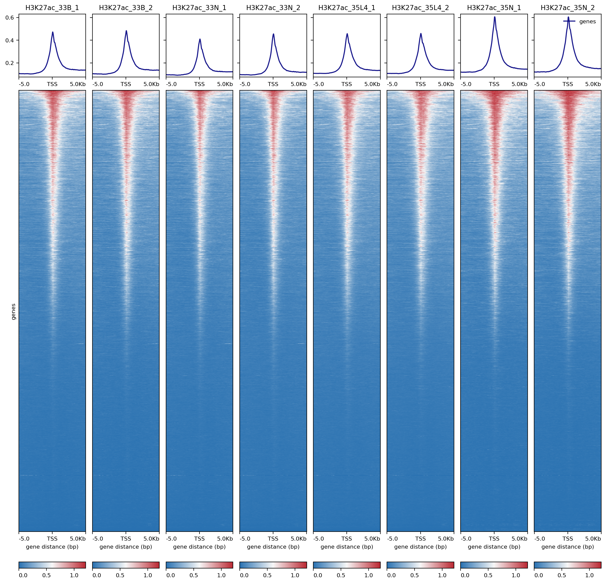

# Part1. the pre-processing on `Linux` system in each CUT&Tag-seq sample

## 1.2 The pre-processing of raw data

To make a loop to execute the pre-processing analysis, we need to write a `sample_list_H3K9me3` file to record the detail information of each sample, including the simple name, and the raw name of sequencing data, by `vim` function on `Linux` system. 

~~~shell
vim sample_list_H3K9me3
drug1_H3K9me3 E0-1_FKDL210272485-1a
drug2_H3K9me3 E0-2_FKDL210272486-1a
drug3_H3K9me3 E0-3_FKDL210272487-1a
Ctrl1_H3K9me3 E-1_FKDL210272482-1a
Ctrl2_H3K9me3 E-2_FKDL210272483-1a
Ctrl3_H3K9me3 E-3_FKDL210272484-1a
KD1_H3K9me3 E5-1_FKDL210272488-1a
KD2_H3K9me3 E5-2_FKDL210272489-1a
KD3_H3K9me3 E5-3_FKDL210272490-1a
KD4_H3K9me3 E6-1_FKDL210272491-1a
KD5_H3K9me3 E6-2_FKDL210272492-1a
KD6_H3K9me3 E6-3_FKDL210272493-1a
IgG_H3K9me3 ES2-IgG_FKDL210272494-1a
~~~

Here, we use the [fastp](https://github.com/OpenGene/fastp) to make a quality control of raw sequencing data. 

~~~shell
cat sample_list_H3K9me3  |while read id;
do echo $id
arr=($id)
fq2=${arr[1]}'_2.fq.gz'
fq1=${arr[1]}'_1.fq.gz'
sample=${arr[0]}
echo $fq1
echo $fq2
echo $sample
fastp -w 16 \
-i ./OTS/CUTTAG/H3K9me2-Cuttag_V2/1.rawdata/${arr[1]}/$fq1 \
-I ./OTS/CUTTAG/H3K9me2-Cuttag_V2/1.rawdata/${arr[1]}/$fq2 \
-o ./OTS_19_CUTTAG_35_samples_TL_PXY_9122/fastp/$sample.out_1.fq.gz \
-O ./OTS_19_CUTTAG_35_samples_TL_PXY_9122/fastp/$sample.out_2.fq.gz \
-j ./OTS_19_CUTTAG_35_samples_TL_PXY_9122/fastp/log_out/$sample.json \
-h ./OTS_19_CUTTAG_35_samples_TL_PXY_9122/fastp/log_out/$sample.html ;
done
~~~

## 1.3 The Alignment of  CUT&Tag-seq data

You should make a new `direction` or `file` to store the output results of alignment. 

~~~R
mkdir -p ./OTS_19_CUTTAG_35_samples_TL_PXY_9122/bowtie2_align
~~~

Then, you need to go back to the direction of `sample_list_H3K9me3` and begin the alignment processing.

~~~shell
cat sample_list_H3K9me3 | while read id ; do
arr=($id)
fq2=${arr[0]}'.out_2.fq.gz'
fq1=${arr[0]}'.out_1.fq.gz'
sample=${arr[0]}
echo $fq2
echo $fq1
echo $sample
bowtie2 -p 25 --very-sensitive -X 2000 \
-x /mnt/data/public_data/reference/Homo_sapiens/UCSC/hg19/Sequence/Bowtie2Index/genome \
-1 ./OTS_19_CUTTAG_35_samples_TL_PXY_9122/fastp/$fq1 \
-2 ./OTS_19_CUTTAG_35_samples_TL_PXY_9122/fastp/$fq2 \
-S ./OTS_19_CUTTAG_35_samples_TL_PXY_9122/bowtie2_align/$sample.sam
samtools sort -@ 30 --no-PG -O BAM \
./OTS_19_CUTTAG_35_samples_TL_PXY_9122/bowtie2_align/$sample.sam \
-o ./OTS_19_CUTTAG_35_samples_TL_PXY_9122/$sample.sort.bam ;
done
~~~

## 1.4 PCR duplicates removing and chrMT ratio summary

~~~shell
bam_files=./OTS_19_CUTTAG_35_samples_TL_PXY_9122
mkdir $bam_files/bed
mkdir -p $bam_files/filter_bam

GATK=./programme/gatk-4.1.3.0/gatk
cat sample_list_H3K9me3 | while read id ; do
arr=($id)
sample=${arr[0]}
echo $sample
$GATK --java-options "-Xmx100G -Djava.io.tmpdir=./" MarkDuplicates \
-I $bam_files/$sample.sort.bam \
-O $bam_files/filter_bam/$sample.filter_dupli.bam \
-M $bam_files/filter_bam/$sample.dups.txt \
-REMOVE_DUPLICATES=true ;
done

cat sample_list_H3K9me3 | while read id ; do
arr=($id)
sample=${arr[0]}
echo $sample
samtools index $bam_files/filter_bam/$sample.filter_dupli.bam
mtReads=$(samtools idxstats  $bam_files/filter_bam/$sample.filter_dupli.bam | grep 'chrM' | cut -f 3)
totalReads=$(samtools idxstats  $bam_files/filter_bam/$sample.filter_dupli.bam | awk '{SUM += $3} END {print SUM}')
echo '==> mtDNA Content:' $(bc <<< "scale=2;100*$mtReads/$totalReads")'%'
samtools flagstat  $bam_files/filter_bam/$sample.filter_dupli.bam > $bam_files/filter_bam/$sample.rmdup.stat
bedtools bamtobed -i $bam_files/filter_bam/$sample.filter_dupli.bam  > $bam_files/bed/$sample.bed 
bedtools genomecov -bg -ibam $bam_files/filter_bam/$sample.filter_dupli.bam  \
-g /mnt/data/public_data/reference/Homo_sapiens/UCSC/hg19/Annotation/Archives/archive-2012-03-09-03-24-41/Genes/ChromInfo.txt > $bam_files/bed/$sample.bedgraph ;
done
~~~

## 1.5 Peaks calling in CUT&Tag-seq data

To better identify the peaks in each sample, there were two major methods were developed to achieve, [SEACR](https://github.com/FredHutch/SEACR) and [MACS](https://github.com/macs3-project/MACS). You could choose the most appropriate methods in your datasets. Here, we would share the codes of both two methods performing.

 ### 	1.5.1 Peaks calling by SEACR

You could visit the classical documents to know more models and detail of each parameters in [SEACR](https://github.com/FredHutch/SEACR) by clicking [here](https://github.com/FredHutch/SEACR). The [SEACR](https://github.com/FredHutch/SEACR) has three model to detect the peaks in each sample, including calling with stringent threshold, with relaxed threshold and selecting the top 1% of regions by AUC. In following codes, we only showed the model with stringent threshold to call the peaks in each sample with and/or without `anti-IgG` sample. 

~~~shell
seacr=./programme/SEACR-master/SEACR_1.3.sh
bam_files=./OTS_19_CUTTAG_35_samples_TL_PXY_9122
mkdir -p $bam_files/SEACR/
cd $bam_files/bed
# if you don't have anti-IgG sample, you need to change 
# 'bash $seacr $sample.bedgraph 0.01 non stringent $sample.seacr_0.01_non' 
# to 
# 'bash $seacr $sample.bedgraph IgG_H3K9me3.bedgraph norm stringent $sample.vs.IgG.seacr_norm'
cat $bam_files/sample_list_H3K9me3 | while read id ; do
arr=($id)
sample=${arr[0]}
echo $sample
bash $seacr $sample.bedgraph 0.01 non stringent $sample.seacr_0.01_non ;
done
mv *seacr_0.01_non* $bam_files/SEACR/
~~~

###		1.5.2 Peaks calling by MACS (the latest version of MACS is macs3)

You also could visit the classical documents to know more models and detail of each parameters in [MACS](https://github.com/macs3-project/MACS) by clicking [here](https://github.com/macs3-project/MACS). The [MACS](https://github.com/macs3-project/MACS) also has three models to detect the peaks in each sample, including calling on TF ChIP-seq, calling on Histone Mark ChIP-seq and calling on ATAC-seq. In following codes, we showed two models, `broad` and `narrow`, to call the peaks in each sample without `anti-IgG` sample. 

~~~shell
mkdir -p $bam_files/MACS3/broad
mkdir -p $bam_files/MACS3/narrow
MACS3=/home/xiangyu/.local/bin/macs3

cat $bam_files/sample_list_H3K9me3 | while read id ; do
arr=($id)
sample=${arr[0]}
echo $sample
$MACS3 callpeak -g mm --broad --broad-cutoff 0.1 -q 0.05 -f BAMPE \
-t $bam_files/filter_bam/$sample.filter_dupli.bam \
-n $sample.macs3.broad \
--outdir $bam_files/MACS3/broad

$MACS3 callpeak -g mm -q 0.05 -f BAMPE \
-t $bam_files/filter_bam/$sample.filter_dupli.bam \
-n $sample.macs3.narrow \
--outdir $bam_files/MACS3/narrow ;
done
~~~

## 1.6 The `.bw` and `.bedgraph` files generation

To better visualize and verify the results of CUT&Tag-seq data in IGV. We need to convert the `.bam` files into `.bw` files by the function `bamCoverage` implemented in  [deeptools](https://github.com/deeptools/deepTools) which you could get the documents by clicking [here](https://deeptools.readthedocs.io/en/develop/). You should pay attention to set the parameters`--binSize` and `--normalizeUsing`. The default of  `--binSize` were `50bp`, if you want to get more smooth distribution, you could increase the bin number. And you also could visit the classical documents to know more models and detail of each parameters in [deeptools](https://github.com/deeptools/deepTools) by clicking [here](https://deeptools.readthedocs.io/en/develop/). 

~~~shell
bam_files=./OTS_19_CUTTAG_35_samples_TL_PXY_9122
cd $bam_files
mkdir bw_files

cat sample_list | while read id ; do
arr=($id)
sample=${arr[0]}
echo $sample
bamCoverage -p 30 --normalizeUsing BPM --binSize 50 -b $bam_files/filter_bam/$sample.filter_dupli.bam -o $bam_files/filter_bam/$sample.bw ;
done

mv *bw ./bw_files
~~~

## 1.7  The Visualization of global distribution

Then, you could get the global distribution of your CUT&Tag-seq data in each sample. The heatmap would be generated by the function `computeMatrix` and `plotHeatmap` implemented in [deeptools](https://github.com/deeptools/deepTools). And there are also three models to visualize the global distribution, including centralizing peaks at TSS, genebody and the center of each peaks. In following codes, we showed the two models, centralizing peaks at TSS and genebody , to  visualize the global distribution. 

~~~shell
bed=./reference_bed/hg19.ucsc.refseq.bed
heatmapout=./OTS_19_CUTTAG_35_samples_TL_PXY_9122/filter_bam/bw_files/heatmap_out
mkdir $heatmapout
cd ./OTS_19_CUTTAG_35_samples_TL_PXY_9122/filter_bam/bw_files

computeMatrix scale-regions \
-R $bed -S IgG_H3K9me3.bw Ctrl1_H3K9me3.bw Ctrl2_H3K9me3.bw Ctrl3_H3K9me3.bw drug1_H3K9me3.bw drug2_H3K9me3.bw drug3_H3K9me3.bw KD1_H3K9me3.bw KD2_H3K9me3.bw KD3_H3K9me3.bw KD4_H3K9me3.bw KD5_H3K9me3.bw KD6_H3K9me3.bw \
--beforeRegionStartLength 5000 --regionBodyLength 5000 --afterRegionStartLength 5000 \
--numberOfProcessors 30 --skipZeros \
-o $heatmapout/All_H3K9me3_genebody.mat.gz 
plotHeatmap -m $heatmapout/All_H3K9me3_genebody.mat.gz  \
 -out $heatmapout/All_H3K9me3_genebody.png \
 --colorList '#2971B1,#F7F7F7,#BB2933' '#2971B1,#F7F7F7,#BB2933' '#2971B1,#F7F7F7,#BB2933' '#2971B1,#F7F7F7,#BB2933' '#2971B1,#F7F7F7,#BB2933' '#2971B1,#F7F7F7,#BB2933' '#2971B1,#F7F7F7,#BB2933' '#2971B1,#F7F7F7,#BB2933' '#2971B1,#F7F7F7,#BB2933' '#2971B1,#F7F7F7,#BB2933' '#2971B1,#F7F7F7,#BB2933' '#2971B1,#F7F7F7,#BB2933' '#2971B1,#F7F7F7,#BB2933'
~~~

~~~shell
bam_files=./CUT_tag_9_WBH_MKI67_20211021_16samples/filter_bam
cd $bam_files
bed=./reference_bed/mm10.ucsc.refseq.bed
heatmapout=./CUT_tag_9_WBH_MKI67_20211021_16samples/heatmap_out

mkdir $heatmapout
computeMatrix reference-point --referencePoint TSS -b 5000 -a 5000 \
-R $bed -S H3K27ac_33B_1.bw H3K27ac_33B_2.bw H3K27ac_33N_1.bw H3K27ac_33N_2.bw H3K27ac_35L4_1.bw H3K27ac_35L4_2.bw H3K27ac_35N_1.bw H3K27ac_35N_2.bw \
--numberOfProcessors 30 --skipZeros \
-o $heatmapout/ALL_H3K27ac_TSS_split.mat.gz 
plotHeatmap -m $heatmapout/ALL_H3K27ac_TSS_split.mat.gz  \
 -out $heatmapout/ALL_H3K27ac_TSS_split.png \
 --colorList  '#2971B1,#F7F7F7,#BB2933' '#2971B1,#F7F7F7,#BB2933' '#2971B1,#F7F7F7,#BB2933' '#2971B1,#F7F7F7,#BB2933' '#2971B1,#F7F7F7,#BB2933' '#2971B1,#F7F7F7,#BB2933' '#2971B1,#F7F7F7,#BB2933' '#2971B1,#F7F7F7,#BB2933'
~~~

