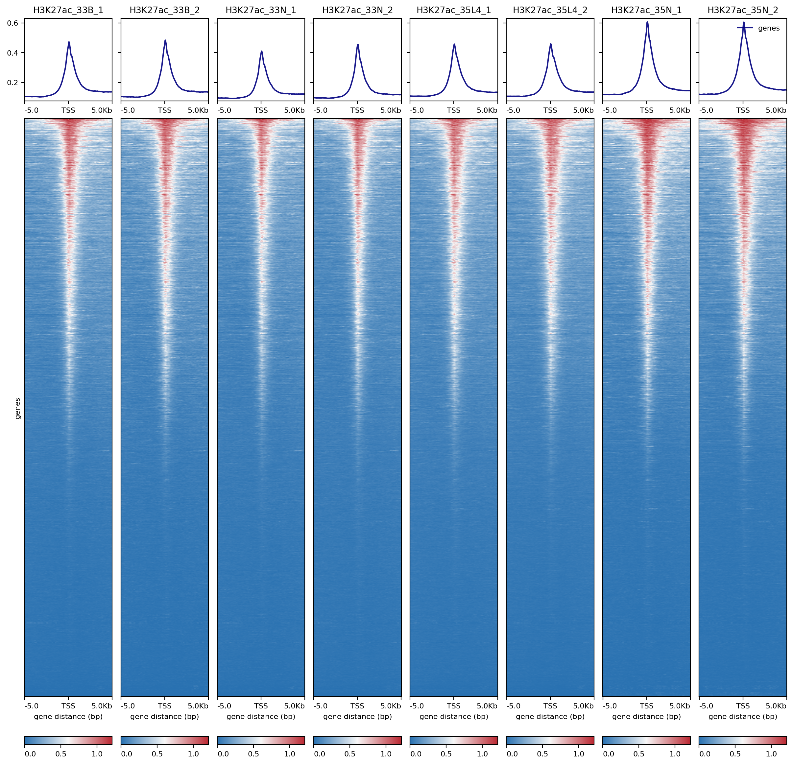

# Pipeline of Epigenome data analysis

## Overview

This workshop recorded the whole processing steps of Epigenome data analysis, including the CUT&Tag-seq (Chip-seq) and ATAC-seq data analysis, in CC-LY Lab written by Shawn (Xiangyu) Pan and Xuelan Chen. This page would be helpful and easy to be read and operated, especially for the bioinformatic new-hand. We will try to keep updating of ` Pipeline-of-Epigenome`. And this pipeline is flexible, you could broaden more analysis steps and tools integrated into this page, such as TF enrichment, bulk ATAC-seq data deconvolution and et al. We also expected you could add comments and provide request to improve this page. Hope you could had a good grip of the basic Epigenome data analysis rapidly and smoothly

## **The analysis pipeline included**

## 	1. CUT&Tag-seq (Chip-seq)

1. [x] The introduction of the tools on `Linux` system
2. [x] Quality Control of raw data
3. [x] Alignment
4. [x] PCR duplicates removing
5. [x] Peak calling
   1. [x] MACS2/3
   2. [x] SEACR
6. [x] The `.bw` and `.bedgraph` files generation
7. [x] Visualization of global distribution
8. [ ] Differential Peaks analysis
   1. [ ] Quantify peaks in all samples
   2. [ ] PCA analysis of all samples.
   3. [ ] hierarchical clustering of all samples
   4. [ ] data normalization
   5. [ ] Differential Peaks identification
   6. [ ] Volcano map of Differential Peaks 
   7. [ ] gene annotation
9. [ ] Motif/TF identification
10. [ ] et al.

## 	2. ATAC-seq

1. [ ] The introduction of the tools on `Linux` system
2. [ ] Quality Control of raw data
3. [ ] Alignment
4. [ ] PCR duplicates removing
5. [ ] Peak calling
   1. [ ] MACS2/3
6. [ ] The `.bw` and `.bedgraph` files generation
7. [ ] Visualization of global distribution
8. [ ] Differential Peaks analysis
9. [ ] Visualization of Differential Peaks
10. [ ] Motif/TF identification
11. [ ] CNV and Mutation
12. [ ] et al.

---

You also could learn the standard analysis pipeline from the official document by clicking [here](https://yezhengstat.github.io/CUTTag_tutorial/). However, this pipeline is designed based on the single-index 25x25 PE Illumina sequencing data. In our lab, we prefer use the `Novaseq 6000` platform to sequence the library with PE150. Hence, we modified the analysis pipeline to be better in our data processing. 

Besides, you could get more skills and knowledge by reading this [post](https://github.com/crazyhottommy/ChIP-seq-analysis), which comprehensively collected the algorithms and tools in CUT&Tag-seq (Chip-seq) analysis. 

## 1.1 The introduction of the tools on `Linux` system

Before the learning of this page, you should install the following tools firstly on your `Liunx` system:

~~~shell
# ubuntu上需要安装的软件
# The quality control processing of raw data with multiple threads. 用于多线程数据质控
fastp
# Alignment tools for CUT&Tag-seq analysis. 用于数据比对
bowtie2
# For processing the .bam files, including indexing, alignment summary and extraction. 用于bam文件处理：文件索引,比对统计和过滤操作
samtools
# For PCR duplicates removing.用于PCR去重
gatk
# Conversion form .bam files to .bedgraph. 用于转换bam文件为bedgraph
bedtools
# The peaks calling in CUT&Tag-seq data. 用于检测CUT&Tag样本的peaks
SEACR_1.3.sh
# Visulization and peaks distribution summary 用于可视化bam文件和峰值分布量化，包括bw文件生成
deeptools
~~~

## 1.2 The pre-processing of raw data

To make a loop to execute the pre-processing analysis, we need to write a `sample_list_H3K9me3` file to record the detail information of each sample, including the simple name, and the raw name of sequencing data, by `vim` function on `Linux` system. 

~~~shell
vim sample_list_H3K9me3
drug1_H3K9me3 E0-1_FKDL210272485-1a
drug2_H3K9me3 E0-2_FKDL210272486-1a
drug3_H3K9me3 E0-3_FKDL210272487-1a
Ctrl1_H3K9me3 E-1_FKDL210272482-1a
Ctrl2_H3K9me3 E-2_FKDL210272483-1a
Ctrl3_H3K9me3 E-3_FKDL210272484-1a
KD1_H3K9me3 E5-1_FKDL210272488-1a
KD2_H3K9me3 E5-2_FKDL210272489-1a
KD3_H3K9me3 E5-3_FKDL210272490-1a
KD4_H3K9me3 E6-1_FKDL210272491-1a
KD5_H3K9me3 E6-2_FKDL210272492-1a
KD6_H3K9me3 E6-3_FKDL210272493-1a
IgG_H3K9me3 ES2-IgG_FKDL210272494-1a
~~~

Here, we use the [fastp](https://github.com/OpenGene/fastp) to make a quality control of raw sequencing data. 

~~~shell
cat sample_list_H3K9me3  |while read id;
do echo $id
arr=($id)
fq2=${arr[1]}'_2.fq.gz'
fq1=${arr[1]}'_1.fq.gz'
sample=${arr[0]}
echo $fq1
echo $fq2
echo $sample
fastp -w 16 \
-i /mnt/data/sequencedata/OTS/CUTTAG/H3K9me2-Cuttag_V2/1.rawdata/${arr[1]}/$fq1 \
-I /mnt/data/sequencedata/OTS/CUTTAG/H3K9me2-Cuttag_V2/1.rawdata/${arr[1]}/$fq2 \
-o /mnt/data/user_data/xiangyu/workshop/CUTTAG/OTS_19_CUTTAG_35_samples_TL_PXY_9122/fastp/$sample.out_1.fq.gz \
-O /mnt/data/user_data/xiangyu/workshop/CUTTAG/OTS_19_CUTTAG_35_samples_TL_PXY_9122/fastp/$sample.out_2.fq.gz \
-j /mnt/data/user_data/xiangyu/workshop/CUTTAG/OTS_19_CUTTAG_35_samples_TL_PXY_9122/fastp/log_out/$sample.json \
-h /mnt/data/user_data/xiangyu/workshop/CUTTAG/OTS_19_CUTTAG_35_samples_TL_PXY_9122/fastp/log_out/$sample.html ;
done
~~~

## 1.3 The Alignment of  CUT&Tag-seq data

You should make a new `direction` or `file` to store the output results of alignment. 

~~~R
mkdir /mnt/data/user_data/xiangyu/workshop/CUTTAG/OTS_19_CUTTAG_35_samples_TL_PXY_9122/bowtie2_align
~~~

Then, you need to go back to the direction of `sample_list_H3K9me3` and begin the alignment processing.

~~~shell
cat sample_list_H3K9me3 | while read id ; do
arr=($id)
fq2=${arr[0]}'.out_2.fq.gz'
fq1=${arr[0]}'.out_1.fq.gz'
sample=${arr[0]}
echo $fq2
echo $fq1
echo $sample
bowtie2 -p 25 --very-sensitive -X 2000 \
-x /mnt/data/public_data/reference/Homo_sapiens/UCSC/hg19/Sequence/Bowtie2Index/genome \
-1 /mnt/data/user_data/xiangyu/workshop/CUTTAG/OTS_19_CUTTAG_35_samples_TL_PXY_9122/fastp/$fq1 \
-2 /mnt/data/user_data/xiangyu/workshop/CUTTAG/OTS_19_CUTTAG_35_samples_TL_PXY_9122/fastp/$fq2 \
-S /mnt/data/user_data/xiangyu/workshop/CUTTAG/OTS_19_CUTTAG_35_samples_TL_PXY_9122/bowtie2_align/$sample.sam
samtools sort -@ 30 --no-PG -O BAM \
/mnt/data/user_data/xiangyu/workshop/CUTTAG/OTS_19_CUTTAG_35_samples_TL_PXY_9122/bowtie2_align/$sample.sam \
-o /mnt/data/user_data/xiangyu/workshop/CUTTAG/OTS_19_CUTTAG_35_samples_TL_PXY_9122/$sample.sort.bam ;
done
~~~

## 1.4 PCR duplicates removing and chrMT ratio summary

~~~shell
bam_files=/mnt/data/user_data/xiangyu/workshop/CUTTAG/OTS_19_CUTTAG_35_samples_TL_PXY_9122
mkdir $bam_files/bed
mkdir -p $bam_files/filter_bam

GATK=/mnt/data/user_data/xiangyu/programme/gatk-4.1.3.0/gatk
cat sample_list_H3K9me3 | while read id ; do
arr=($id)
sample=${arr[0]}
echo $sample
$GATK --java-options "-Xmx100G -Djava.io.tmpdir=./" MarkDuplicates \
-I $bam_files/$sample.sort.bam \
-O $bam_files/filter_bam/$sample.filter_dupli.bam \
-M $bam_files/filter_bam/$sample.dups.txt \
-REMOVE_DUPLICATES=true ;
done

cat sample_list_H3K9me3 | while read id ; do
arr=($id)
sample=${arr[0]}
echo $sample
samtools index $bam_files/filter_bam/$sample.filter_dupli.bam
mtReads=$(samtools idxstats  $bam_files/filter_bam/$sample.filter_dupli.bam | grep 'chrM' | cut -f 3)
totalReads=$(samtools idxstats  $bam_files/filter_bam/$sample.filter_dupli.bam | awk '{SUM += $3} END {print SUM}')
echo '==> mtDNA Content:' $(bc <<< "scale=2;100*$mtReads/$totalReads")'%'
samtools flagstat  $bam_files/filter_bam/$sample.filter_dupli.bam > $bam_files/filter_bam/$sample.rmdup.stat
bedtools bamtobed -i $bam_files/filter_bam/$sample.filter_dupli.bam  > $bam_files/bed/$sample.bed 
bedtools genomecov -bg -ibam $bam_files/filter_bam/$sample.filter_dupli.bam  \
-g /mnt/data/public_data/reference/Homo_sapiens/UCSC/hg19/Annotation/Archives/archive-2012-03-09-03-24-41/Genes/ChromInfo.txt > $bam_files/bed/$sample.bedgraph ;
done
~~~

## 1.5 Peaks calling in CUT&Tag-seq data

To better identify the peaks in each sample, there were two major methods were developed to achieve, [SEACR](https://github.com/FredHutch/SEACR) and [MACS](https://github.com/macs3-project/MACS). You could choose the most appropriate methods in your datasets. Here, we would share the codes of both two methods performing.

 ### 	1.5.1 Peaks calling by SEACR

You could visit the classical documents to know more models and detail of each parameters in [SEACR](https://github.com/FredHutch/SEACR) by clicking [here](https://github.com/FredHutch/SEACR). The [SEACR](https://github.com/FredHutch/SEACR) has three model to detect the peaks in each sample, including calling with stringent threshold, with relaxed threshold and selecting the top 1% of regions by AUC. In following codes, we only showed the model with stringent threshold to call the peaks in each sample with and/or without `anti-IgG` sample. 

~~~shell
seacr=/mnt/data/user_data/xiangyu/programme/SEACR-master/SEACR_1.3.sh
bam_files=/mnt/data/user_data/xiangyu/workshop/CUTTAG/OTS_19_CUTTAG_35_samples_TL_PXY_9122
mkdir -p $bam_files/SEACR/
cd $bam_files/bed
# if you don't have anti-IgG sample, you need to change 
# 'bash $seacr $sample.bedgraph 0.01 non stringent $sample.seacr_0.01_non' 
# to 
# 'bash $seacr $sample.bedgraph IgG_H3K9me3.bedgraph norm stringent $sample.vs.IgG.seacr_norm'
cat $bam_files/sample_list_H3K9me3 | while read id ; do
arr=($id)
sample=${arr[0]}
echo $sample
bash $seacr $sample.bedgraph 0.01 non stringent $sample.seacr_0.01_non ;
done
mv *seacr_0.01_non* $bam_files/SEACR/
~~~

###		1.5.2 Peaks calling by MACS (the latest version of MACS is macs3)

You also could visit the classical documents to know more models and detail of each parameters in [MACS](https://github.com/macs3-project/MACS) by clicking [here](https://github.com/macs3-project/MACS). The [MACS](https://github.com/macs3-project/MACS) also has three models to detect the peaks in each sample, including calling on TF ChIP-seq, calling on Histone Mark ChIP-seq and calling on ATAC-seq. In following codes, we showed two models, `broad` and `narrow`, to call the peaks in each sample without `anti-IgG` sample. 

~~~shell
mkdir -p $bam_files/MACS3/broad
mkdir -p $bam_files/MACS3/narrow
MACS3=/home/xiangyu/.local/bin/macs3

cat $bam_files/sample_list_H3K9me3 | while read id ; do
arr=($id)
sample=${arr[0]}
echo $sample
$MACS3 callpeak -g mm --broad --broad-cutoff 0.1 -q 0.05 -f BAMPE \
-t $bam_files/filter_bam/$sample.filter_dupli.bam \
-n $sample.macs3.broad \
--outdir $bam_files/MACS3/broad

$MACS3 callpeak -g mm -q 0.05 -f BAMPE \
-t $bam_files/filter_bam/$sample.filter_dupli.bam \
-n $sample.macs3.narrow \
--outdir $bam_files/MACS3/narrow ;
done
~~~

## 1.6 The `.bw` and `.bedgraph` files generation

To better visualize and verify the results of CUT&Tag-seq data in IGV. We need to convert the `.bam` files into `.bw` files by the function `bamCoverage` implemented in  [deeptools](https://github.com/deeptools/deepTools) which you could get the documents by clicking [here](https://deeptools.readthedocs.io/en/develop/). You should pay attention to set the parameters`--binSize` and `--normalizeUsing`. The default of  `--binSize` were `50bp`, if you want to get more smooth distribution, you could increase the bin number. And you also could visit the classical documents to know more models and detail of each parameters in [deeptools](https://github.com/deeptools/deepTools) by clicking [here](https://deeptools.readthedocs.io/en/develop/). 

~~~shell
bam_files=/mnt/data/user_data/xiangyu/workshop/CUTTAG/OTS_19_CUTTAG_35_samples_TL_PXY_9122
cd $bam_files
mkdir bw_files

cat sample_list | while read id ; do
arr=($id)
sample=${arr[0]}
echo $sample
bamCoverage -p 30 --normalizeUsing BPM --binSize 50 -b $bam_files/filter_bam/$sample.filter_dupli.bam -o $bam_files/filter_bam/$sample.bw ;
done

mv *bw ./bw_files
~~~

## 1.7  The Visualization of global distribution

Then, you could get the global distribution of your CUT&Tag-seq data in each sample. The heatmap would be generated by the function `computeMatrix` and `plotHeatmap` implemented in [deeptools](https://github.com/deeptools/deepTools). And there are also three models to visualize the global distribution, including centralizing peaks at TSS, genebody and the center of each peaks. In following codes, we showed the two models, centralizing peaks at TSS and genebody , to  visualize the global distribution. 

~~~shell
bed=/mnt/data/GEO_SUBMIT/bam_files/ATAC-seq/bam_bw_files/hg19.ucsc.refseq.bed
heatmapout=/mnt/data/user_data/xiangyu/workshop/CUTTAG/OTS_19_CUTTAG_35_samples_TL_PXY_9122/filter_bam/bw_files/heatmap_out
mkdir $heatmapout
cd /mnt/data/user_data/xiangyu/workshop/CUTTAG/OTS_19_CUTTAG_35_samples_TL_PXY_9122/filter_bam/bw_files

computeMatrix scale-regions \
-R $bed -S IgG_H3K9me3.bw Ctrl1_H3K9me3.bw Ctrl2_H3K9me3.bw Ctrl3_H3K9me3.bw drug1_H3K9me3.bw drug2_H3K9me3.bw drug3_H3K9me3.bw KD1_H3K9me3.bw KD2_H3K9me3.bw KD3_H3K9me3.bw KD4_H3K9me3.bw KD5_H3K9me3.bw KD6_H3K9me3.bw \
--beforeRegionStartLength 5000 --regionBodyLength 5000 --afterRegionStartLength 5000 \
--numberOfProcessors 30 --skipZeros \
-o $heatmapout/All_H3K9me3_genebody.mat.gz 
plotHeatmap -m $heatmapout/All_H3K9me3_genebody.mat.gz  \
 -out $heatmapout/All_H3K9me3_genebody.png \
 --colorList '#2971B1,#F7F7F7,#BB2933' '#2971B1,#F7F7F7,#BB2933' '#2971B1,#F7F7F7,#BB2933' '#2971B1,#F7F7F7,#BB2933' '#2971B1,#F7F7F7,#BB2933' '#2971B1,#F7F7F7,#BB2933' '#2971B1,#F7F7F7,#BB2933' '#2971B1,#F7F7F7,#BB2933' '#2971B1,#F7F7F7,#BB2933' '#2971B1,#F7F7F7,#BB2933' '#2971B1,#F7F7F7,#BB2933' '#2971B1,#F7F7F7,#BB2933' '#2971B1,#F7F7F7,#BB2933'
~~~


~~~shell
bam_files=/mnt/data/user_data/xiangyu/workshop/CUTTAG/CUT_tag_9_WBH_MKI67_20211021_16samples/filter_bam
cd $bam_files
bed=/mnt/data/GEO_SUBMIT/bam_files/ATAC-seq/bam_bw_files/mm10.ucsc.refseq.bed
heatmapout=/mnt/data/user_data/xiangyu/workshop/CUTTAG/CUT_tag_9_WBH_MKI67_20211021_16samples/heatmap_out

mkdir $heatmapout
computeMatrix reference-point --referencePoint TSS -b 5000 -a 5000 \
-R $bed -S H3K27ac_33B_1.bw H3K27ac_33B_2.bw H3K27ac_33N_1.bw H3K27ac_33N_2.bw H3K27ac_35L4_1.bw H3K27ac_35L4_2.bw H3K27ac_35N_1.bw H3K27ac_35N_2.bw \
--numberOfProcessors 30 --skipZeros \
-o $heatmapout/ALL_H3K27ac_TSS_split.mat.gz 
plotHeatmap -m $heatmapout/ALL_H3K27ac_TSS_split.mat.gz  \
 -out $heatmapout/ALL_H3K27ac_TSS_split.png \
 --colorList  '#2971B1,#F7F7F7,#BB2933' '#2971B1,#F7F7F7,#BB2933' '#2971B1,#F7F7F7,#BB2933' '#2971B1,#F7F7F7,#BB2933' '#2971B1,#F7F7F7,#BB2933' '#2971B1,#F7F7F7,#BB2933' '#2971B1,#F7F7F7,#BB2933' '#2971B1,#F7F7F7,#BB2933'
~~~



## 1.8 Differential Peaks analysis


In this page, ```GenomicAlignments``` and ```Rsamtools``` were used to quantify the counts of transcriptome  data. In old version, we used FPKM and TPM for heatmap visualization and gene set enrichment analysis, however, in latest version,  DESeq2 normalized data , which was much better to reduce the effect of gene body and library size, were used to describe the expression pattern of each gene. And the pathways enrichment also based on the DESeq2 normalized data, especially for GSEA processing. 

Here, ```DESeq2 pipeline``` also was used to identify the differentiated expressed genes. There were some essential parameters to set the cutoff of DEG detecting in this pipeline. The detail information would be explained in following pages. To direct visualize the DEGs' function, ```clusterprofiler``` was implemented in this pipeline. GO/KEGG database could be enriched by DEGs with default parameter.  Besides, we also integrated the GSEA processing in following page.

- Before, we used this pipeline, there were some softwares should be installed: 

~~~shell
#STAR
STAR_2.6.0a

#Rscript
R scripting front-end version 3.5.1 (2018-07-02)
~~~

- Then, you could begin the learning of [The alignment of bulk RNA-seq](step1.md)

## 2. The post-processing steps

After you running out the ` pre-processing steps`, you could directly begin [The quantification of genes and the identification of DEG.](step2.md) You could could visit the page by clinking [here.](step2.md)

## 3. The optional methods  in transcripts quantification and p-value calculation

## 3.1 The summary of quantification of transcripts methods  

- And sometimes, you want to quantify the expression levels of each transcripts in bulk RNA-seq, I suggest you follow next pipeline, quantified by ``stringtie`` and/or `RSEM`. 

  [Part 1. The quantification of transcripts by stringtie ](step3.md)

  [Part 2. The quantification of transcripts by RSEM](step4.md)

## 3.2 The summary of some statistic methods

- When we compared the expression levels of candidate gene in different biology group, statistic power is so important that could determine the confidence of the results. To better support our hypothesis of candidate genes, especially doing analysis in multiple clinical cohorts, we could refer to more methods of p-value calculation. 
- [Here](pvalue_cal.md), I had generated a [summary of the methods to calculate the p-value](pvalue_cal.md) in DEG identification. And you also could visit them by clicking [here](pvalue_cal.md)

## 4. The identification of alternative splicing events

- After you learn all the steps mentioned above, you could begin the learning of [The identification of alternative splicing events](AS_identified.md)

## 5. Keep updating


